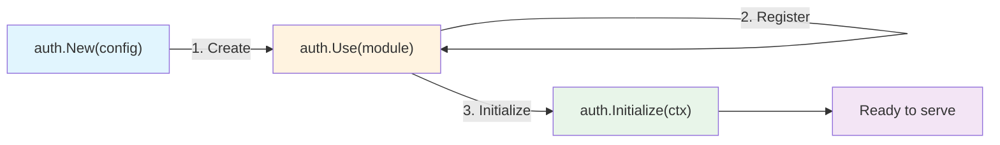
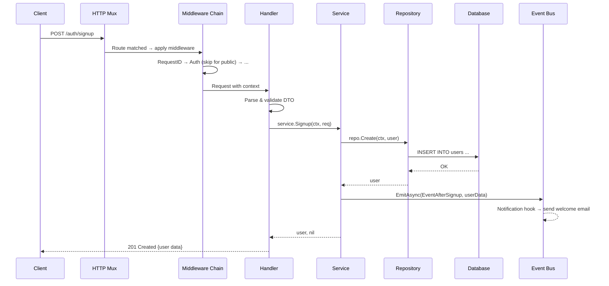
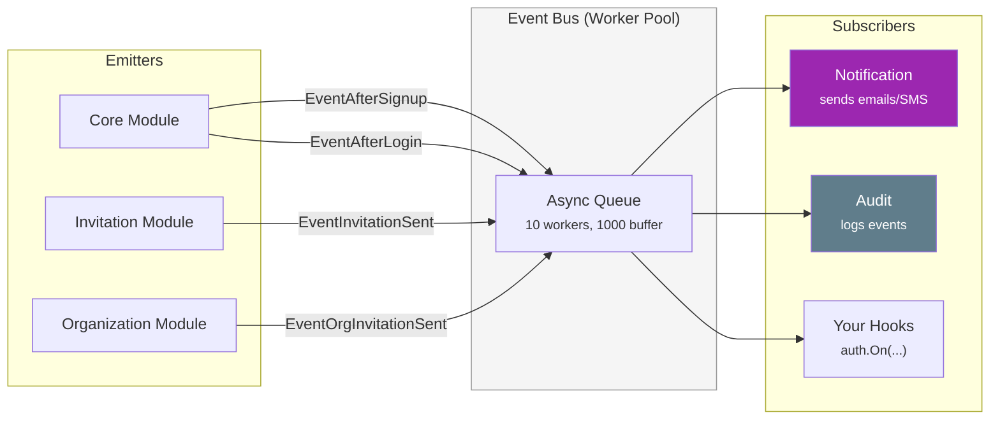
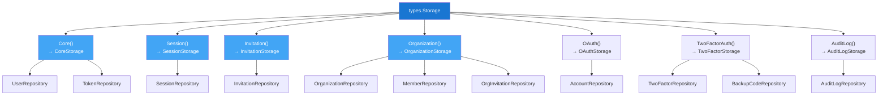
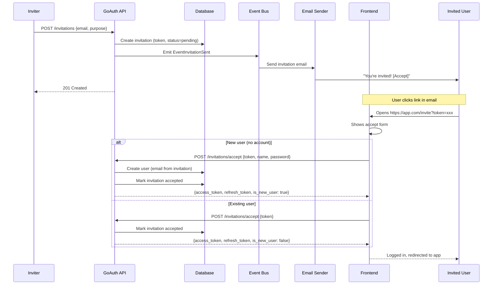
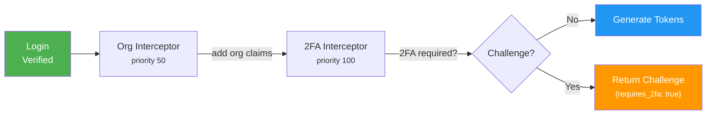

# Architecture Guide

This guide explains how GoAuth is built internally. Read this if you want to contribute, build a custom module, or understand the design decisions behind the library.

## High-Level Overview

GoAuth is a **modular, framework-agnostic authentication library** for Go. It is not a standalone service — it embeds into your application. Everything is built around a plugin system where modules register themselves with a central `Auth` instance.

```
┌─────────────────────────────────────────────────────────────────────┐
│                        Your Application                             │
│                                                                     │
│   ┌─────────────────────────────────────────────────────────────┐   │
│   │                      GoAuth Library                         │   │
│   │                                                             │   │
│   │   ┌─────────┐  ┌─────────┐  ┌──────────┐  ┌───────────┐   │   │
│   │   │  Core   │  │ Session │  │ 2FA      │  │ OAuth     │   │   │
│   │   │ Module  │  │ Module  │  │ Module   │  │ Module    │   │   │
│   │   └────┬────┘  └────┬────┘  └────┬─────┘  └─────┬─────┘   │   │
│   │        │             │            │              │          │   │
│   │   ┌────┴─────────────┴────────────┴──────────────┴─────┐   │   │
│   │   │              Shared Infrastructure                  │   │   │
│   │   │  EventBus · SecurityManager · Middleware · Logger   │   │   │
│   │   └────────────────────────┬────────────────────────────┘   │   │
│   │                            │                                │   │
│   │   ┌────────────────────────┴────────────────────────────┐   │   │
│   │   │                 Storage Layer                        │   │   │
│   │   │         GORM (Postgres · MySQL · SQLite)             │   │   │
│   │   └─────────────────────────────────────────────────────┘   │   │
│   └─────────────────────────────────────────────────────────────┘   │
└─────────────────────────────────────────────────────────────────────┘
```

## Package Layout

```
goauth/
├── pkg/                    ← Public API (what consumers import)
│   ├── auth/               ← Auth instance, lifecycle (New → Use → Initialize)
│   ├── config/             ← Config structs, Module interface
│   ├── models/             ← Data models + repository interfaces
│   ├── types/              ← Shared types (events, storage, errors, security)
│   ├── modules/            ← Proxy packages (thin wrappers around internal/)
│   │   ├── session/
│   │   ├── invitation/
│   │   ├── organization/
│   │   └── ...
│   └── adapters/           ← Framework adapters (stdhttp, gin, etc.)
│
├── internal/               ← Implementation (not importable externally)
│   ├── modules/            ← Module implementations
│   │   ├── core/           ← Signup, login, password, verification
│   │   │   ├── module.go
│   │   │   ├── handlers/
│   │   │   ├── services/
│   │   │   ├── middlewares/
│   │   │   ├── docs/openapi.yml
│   │   │   └── migrations/
│   │   ├── session/
│   │   ├── invitation/
│   │   └── ...
│   ├── events/             ← EventBus + worker pool
│   ├── security/           ← JWT, hashing, encryption
│   └── middleware/          ← Global middleware manager
│
├── storage/                ← Storage backends
│   └── gorm/               ← GORM implementation
│       ├── core/
│       ├── session/
│       ├── invitation/
│       ├── organization/
│       └── ...
│
├── cli/                    ← Developer tools
│   └── goauth-gen/         ← Stub generator CLI
│
└── docs/                   ← Documentation site (Docusaurus)
```

**Key rule:** `pkg/` never leaks `internal/` types. All public-facing types live in `pkg/types/` or `pkg/models/`. The `pkg/modules/` proxy packages re-export internal module constructors with clean signatures.

## Three-Phase Lifecycle

Every GoAuth application follows this sequence:



### Phase 1: `auth.New(config)`
- Validates config, creates logger, event bus, security manager
- Auto-registers the **Core module** (always required)
- Returns `*Auth` — not yet usable

### Phase 2: `auth.Use(module)`
- Registers modules one at a time
- Validates dependencies (e.g., 2FA requires Core)
- **Panics if called after Initialize**
- Session and Stateless are mutually exclusive

### Phase 3: `auth.Initialize(ctx)`
- Runs migrations (if `Migration.Auto: true`)
- Calls `Init()` on every registered module (creates services, handlers)
- Registers event hooks
- Collects routes from all modules
- If no auth module registered, defaults to Stateless

## Module Contract

Every module implements this 8-method interface:

```go
type Module interface {
    Name() string                                          // Unique identifier
    Init(ctx context.Context, deps ModuleDependencies) error // Initialize with shared deps
    Routes() []RouteInfo                                   // HTTP endpoints
    Middlewares() []MiddlewareConfig                        // Middleware definitions
    RegisterHooks(events EventBus) error                   // Event subscriptions
    Dependencies() []string                                // Required module names
    OpenAPISpecs() []byte                                  // Embedded OpenAPI YAML
    Migrations() ModuleMigrations                          // Per-dialect SQL migrations
}
```

All modules receive the same `ModuleDependencies` struct during `Init()`:

```
ModuleDependencies
├── Storage            ← Type-safe storage (Storage.Core(), Storage.Session(), etc.)
├── Config             ← Global config
├── Logger             ← Structured logger
├── Events             ← Event bus for pub/sub
├── MiddlewareManager  ← Register middleware
├── SecurityManager    ← JWT, hashing, encryption
├── AuthInterceptors   ← Hook into login flow (2FA challenges, org claims)
└── Options            ← Module-specific options
```

## Module Dependency Graph

```mermaid
graph TD
    Core["Core<br/><small>signup, login, password, verification</small>"]

    Session["Session<br/><small>cookie-based auth</small>"]
    Stateless["Stateless<br/><small>JWT refresh tokens</small>"]

    TwoFactor["Two-Factor<br/><small>TOTP + backup codes</small>"]
    OAuth["OAuth<br/><small>Google, GitHub, etc.</small>"]
    MagicLink["Magic Link<br/><small>passwordless email</small>"]
    Admin["Admin<br/><small>user CRUD</small>"]
    Audit["Audit<br/><small>event logging</small>"]
    Invitation["Invitation<br/><small>platform invites</small>"]
    Organization["Organization<br/><small>multi-tenant</small>"]
    Notification["Notification<br/><small>email/SMS delivery</small>"]
    Captcha["Captcha<br/><small>bot protection</small>"]
    CSRF["CSRF<br/><small>token protection</small>"]

    Core --> Session
    Core --> Stateless
    Core --> TwoFactor
    Core --> OAuth
    Core --> MagicLink
    Core --> Admin
    Core --> Audit
    Core --> Invitation
    Core --> Organization
    Core --> Notification
    Core --> CSRF

    style Core fill:#4CAF50,color:#fff
    style Session fill:#FF9800,color:#fff
    style Stateless fill:#FF9800,color:#fff
    style Notification fill:#9C27B0,color:#fff

    linkStyle default stroke:#999
```



All modules depend on **Core** (auto-registered). **Session** and **Stateless** are mutually exclusive — registering both panics. **Notification** is a pure delivery layer with no routes.

## Request Flow

How an HTTP request flows through GoAuth:



### Middleware Priority

Higher priority = runs first:

| Priority | Middleware | Scope |
|----------|-----------|-------|
| 100 | CORS (user-provided) | External |
| 90 | RequestID | Global |
| 50 | Auth (JWT validation) | Per-route |
| 45 | Org Auth | Per-route |
| 40 | 2FA Verify | Per-route |

## Event System

GoAuth uses an async event bus for cross-module communication. Modules emit events; other modules subscribe.



**Key design:** Notification hooks for must-have emails (password reset, magic link, invitations, 2FA) are always registered. They only fire when the corresponding module emits the event. Optional emails (welcome, login alerts) have config flags.

## Storage Architecture

Storage is type-safe — each module accesses its own storage interface:



**Custom storage:** Implement the repository interfaces to use any database. Use `goauth-gen storage all` to scaffold stubs:
```bash
go install github.com/bete7512/goauth/cli/goauth-gen@latest
goauth-gen storage all --output ./mystorage --package mystorage
```

## Migration System

Each module owns its migrations. They are embedded via `//go:embed` and applied per-dialect:

```
internal/modules/core/migrations/
├── postgres/
│   ├── 000_init_up.sql
│   ├── 000_init_down.sql
│   ├── 001_add_lockout_columns_up.sql
│   └── 001_add_lockout_columns_down.sql
├── mysql/
│   └── ...
└── sqlite/
    └── ...
```

Migrations are tracked in a `goauth_migrations` table. Each record stores `module_name`, `version`, `dialect`, and `applied_at`. During `Initialize()`, GoAuth compares applied versions against embedded migrations and applies any new ones in order.

**Adding a migration:** Create a new versioned file (e.g., `002_add_column_up.sql`) in each dialect directory. The module's `Migrations()` method picks it up automatically via `//go:embed migrations`.

## Invitation Flow (Complete)

The invitation system supports both platform invitations and org invitations. Both follow the same pattern:



**Key design decisions:**
- Accept/decline endpoints are **public** (no auth). The invitation token is the authorization.
- The email link points to a **frontend URL** (`CallbackURL`), not the API. The frontend orchestrates the flow.
- New users are created with `email_verified: true` (they proved ownership by receiving the email).
- Auth tokens are returned immediately — the user is logged in right after accepting.

## Auth Interceptors

Interceptors hook into the login flow to enrich JWT claims or present challenges:



Interceptors run in priority order (higher first). Each can:
- **Add claims** to the JWT (e.g., `active_org_id`, `org_role`)
- **Return a challenge** (e.g., 2FA required) that pauses the login flow
- **Add response data** (e.g., organization list)

## Service Pattern

All modules follow the same pattern:

```go
// Exported interface — handlers depend on this
type UserService interface {
    Signup(ctx context.Context, req *dto.SignupRequest) (*models.User, *types.GoAuthError)
}

// Unexported struct — real implementation
type userService struct {
    deps     config.ModuleDependencies
    userRepo models.UserRepository
}

// Constructor returns concrete type satisfying the interface
func NewUserService(deps config.ModuleDependencies, ...) *userService {
    return &userService{deps: deps, ...}
}
```

**Error convention:** Services return `*types.GoAuthError` (not `error`). This carries an HTTP status code and error code for consistent API responses.

## Contributing a New Module

1. Create `internal/modules/yourmodule/` with `module.go`, `config.go`, `handlers/`, `services/`, `docs/openapi.yml`
2. Add module name constant to `pkg/types/module.go`
3. Add route names to `pkg/types/routes.go`
4. If storage needed: add interfaces to `pkg/models/`, storage interface to `pkg/types/storage.go`, GORM impl to `storage/gorm/yourmodule/`
5. If events needed: add event types to `pkg/types/events.go`, event data to `pkg/types/event_data.go`
6. Create proxy package `pkg/modules/yourmodule/`
7. Add migrations in `migrations/{postgres,mysql,sqlite}/`
8. Write tests (testify/suite + uber/mock)
9. Add OpenAPI spec

Reference implementation: `internal/modules/audit/` (simple) or `internal/modules/invitation/` (medium complexity).
